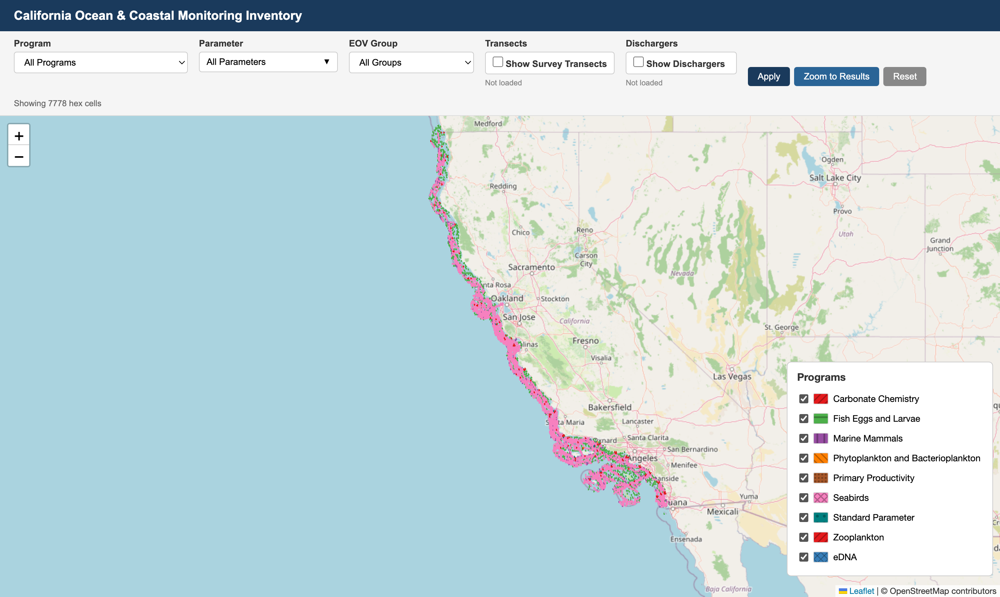

# California Ocean & Coastal Monitoring Inventory

An interactive Leaflet map of California ocean and coastal monitoring programs. Displays monitoring coverage as hex grid cells, survey transects, and point-based discharger/WWTP monitoring stations.



---

## Repository Structure

```
ca-ocean-monitoring-map/
├── R/
│   ├── paths.R                    # shared path config (sourced by all scripts)
│   ├── build_program_layer.R      # process one program/theme folder → hex GeoJSON
│   ├── build_discharger_layer.R   # process discharger CSVs → point GeoJSON
│   └── build_combine_map.R        # combine all layers → Master_Inventory.geojson
├── web/
│   └── index.html                 # interactive map (Leaflet)
├── outputs/                       # built layers (git-ignored; synced to GCS)
├── README.md
└── .gitignore
```

---

## Paths & data folder

All scripts source `R/paths.R`, the single source of truth for file locations:

- **`dir_data`** — raw input data root. Defaults to the shared Google Drive folder
  `~/My Drive/projects/calcofi/data-public/_projects/ca-ocean-monitoring-map/`.
  Override per machine with the `CALCOFI_DATA` environment variable.
- **`dir_out`** — `outputs/` in the repo (via `here()`); built GeoJSON/CSV layers,
  synced to Google Cloud Storage.

The data folder holds the input CSVs (organized in per-theme/program subfolders)
plus three reference files used by the program builder:

- `Attribute_Table.csv` — program/parameter metadata lookup
- `ca_state/CA_State.shp` (+ sidecars) — CA boundary for the coastal clip
- `gebco_2025_*.tif` — GEBCO 2025 seafloor-depth raster

Override the data root for a different machine:

```bash
export CALCOFI_DATA="/path/to/data/ca-ocean-monitoring-map"
```

---

## Prerequisites

**R packages:**
```r
install.packages(c("tidyverse", "sf", "terra", "janitor", "here", "glue"))
```

---

## How to Run

### Step 1 — Build each program/theme layer

`build_program_layer.R` processes one input folder under `dir_data` into a hex
GeoJSON. Select the folder with the `PROGRAM` environment variable:

```bash
PROGRAM="eDNA" Rscript R/build_program_layer.R
```

Run once per folder. Output lands in `outputs/<program>/<chunk>/<program>.geojson`
plus a `transects.csv` and diagnostic CSVs. Folder names that aren't programs in
`Attribute_Table.csv` (the parameter themes) get a friendly title from the
`theme_titles` map near the top of the script.

Build all folders:
```bash
for d in "$CALCOFI_DATA"/*/; do
  name=$(basename "$d")
  case "$name" in ca_state) continue;; esac
  PROGRAM="$name" Rscript R/build_program_layer.R
done
```

### Step 2 — Build discharger layer (optional)

```bash
Rscript R/build_discharger_layer.R
```
Reads `dir_data/Dischargers/` → `outputs/Dischargers/Dischargers.geojson`.
Skips cleanly if no `Dischargers/` folder exists.

### Step 3 — Combine everything

```bash
Rscript R/build_combine_map.R
```
Merges all program GeoJSONs into `outputs/Master_Inventory.geojson` and
`outputs/transects.csv` (discharger point layers excluded).

### Step 4 — Serve the map locally

The web app fetches three artifacts relative to `DATA_BASE` (a constant near the
top of the `<script>` in `web/index.html`): `Master_Inventory.geojson`,
`transects.csv`, and each `DISCHARGER_SOURCES` path. With `DATA_BASE = ''` they
load from the same folder as `index.html`.

```bash
# copy built artifacts next to index.html, then serve
cp outputs/Master_Inventory.geojson outputs/transects.csv web/ 2>/dev/null
cp -r outputs/Dischargers web/ 2>/dev/null
cd web && python3 -m http.server 8000
# open http://localhost:8000
```

---

## Hosting

### GitHub Pages (current deployment)

The map is live at <https://calcofi.io/2026-ucla-ca-ocean-monitoring-map/>.
`.github/workflows/pages.yml` publishes the `web/` folder on every push to
main. The built artifacts (`Master_Inventory.geojson`, `transects.csv`) are
committed alongside `index.html` and served same-origin, so `DATA_BASE = ''`
and no bucket or CORS setup is needed. After rebuilding layers:

```bash
cp outputs/Master_Inventory.geojson outputs/transects.csv web/
git add web/ && git commit -m "data: rebuild layers" && git push
```

### Data on Google Cloud Storage (alternative)

Host the built layers in a public GCS bucket and point the web app at it.

```bash
# one-time bucket setup (public-read static data)
gsutil mb -l us-west1 gs://calcofi-monitoring-map
gsutil iam ch allUsers:objectViewer gs://calcofi-monitoring-map

# CORS so the browser can fetch cross-origin
printf '[{"origin":["*"],"method":["GET"],"responseHeader":["Content-Type"],"maxAgeSeconds":3600}]' > cors.json
gsutil cors set cors.json gs://calcofi-monitoring-map

# publish built layers (re-run after each rebuild)
gsutil -m rsync -r outputs/ gs://calcofi-monitoring-map/
```

Then set in `web/index.html`:
```js
const DATA_BASE = 'https://storage.googleapis.com/calcofi-monitoring-map/';
```

### Static site — pick one

- **GitHub Pages:** enable Pages on the repo serving from `/web` (or move
  `index.html` to `/docs`). Only `index.html` is committed; data comes from GCS
  via `DATA_BASE`.
- **Google VM:** copy `web/` to the VM and serve via nginx/Apache (or
  `python3 -m http.server` behind the existing reverse proxy). Data via `DATA_BASE`.

---

## Map Features

- **Hex grid** — monitoring coverage by program/theme, colored and patterned per layer
- **Filters** — filter by program, parameter, or EOV group
- **Transects** — survey cruise tracks loaded from `transects.csv`
- **Dischargers** — WWTP/ocean discharger stations, colored per facility
- **Bathymetry** — GEBCO 2025 seafloor depth (pre-computed per hex)
- **Popups** — parameters, depth range, GEBCO seafloor depth, coordinates

---

## Adding a New Layer

1. Place CSVs in a new subfolder of the data root (`dir_data`).
2. `PROGRAM="New Folder" Rscript R/build_program_layer.R`
3. (Optional) add a `theme_titles` entry in `build_program_layer.R` for a nice label.
4. `Rscript R/build_combine_map.R` to regenerate `Master_Inventory.geojson`.

### Adding a New Discharger Layer

1. Run `build_discharger_layer.R` (reads `dir_data/Dischargers/`).
2. Add the folder name to `discharger_folder_names` in `build_combine_map.R`.
3. Add an entry to `DISCHARGER_SOURCES` in `web/index.html`:
```javascript
const DISCHARGER_SOURCES = [
  { path: 'Dischargers/Dischargers.geojson', label: 'Dischargers' },
  { path: 'NewLayer/NewLayer.geojson',        label: 'New Layer'  }
];
```
